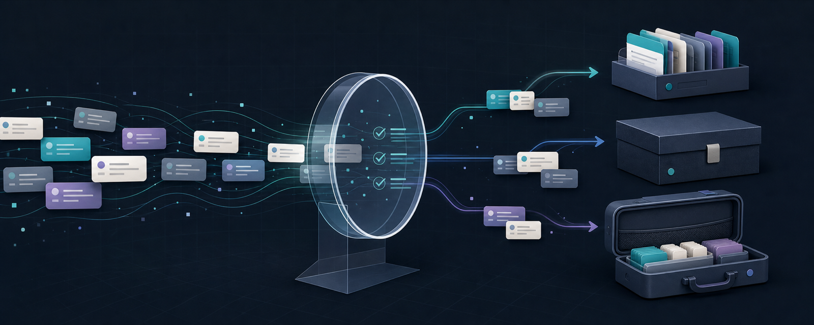

<p align="center">
  
</p>

# Codex History Toolkit

Audit, organize, and move local Codex conversation history without treating a
private state directory like an ordinary pile of files.

The `codex-history` command provides three separate workflows:

| Workflow | Purpose | Changes `CODEX_HOME`? |
| --- | --- | --- |
| `audit` | Inventory, classify, and diagnose local history | No |
| `archive` | Move reviewed threads into Codex's archive state using the official CLI | Yes, only after an explicit plan and confirmation |
| `export` | Copy meaningful interactive conversations into a private migration bundle | No |

> [!IMPORTANT]
> Archiving is useful for organization and reducing the active local catalog,
> but it is **not** a repair for sidebar indexing or rendering bugs. Export is a
> file-level migration aid, not an archive operation or database import.

Codex History Toolkit is an independent community project. It is not affiliated
with or endorsed by OpenAI. Codex's local storage formats are implementation
details and may change; always audit with the version of the tool you intend to
use before taking action.

## Why this exists

A busy Codex home can contain interactive chats, CLI sessions, scheduled work,
spawned subagents, guardian threads, empty startup shells, archived rollouts,
and database-only anomalies. Those records do not all have the same value or
the same risk.

This toolkit turns that directory into a reviewable inventory. It minimizes
content exposure by default, treats unknown sources as ambiguous, and makes
state-changing archival a separate, verified operation.

## Requirements

- Python 3.9 or newer
- macOS as the primary supported platform; other Unix-like systems may work
- A local Codex home, normally `~/.codex`
- The `codex` CLI on `PATH` only when applying an archive plan

There are no third-party runtime dependencies.

## Install from source

Clone or download the repository, then run:

```sh
cd codex-history-toolkit
python3 -m venv .venv
source .venv/bin/activate
python3 -m pip install .
codex-history --version
```

Contributors can install an editable copy instead:

```sh
python3 -m pip install -e .
```

The repository-local `./codex-history` launcher is also available without an
installation.

## First audit

An audit is the safest place to begin:

```sh
codex-history audit --require-stable
```

The command reads `CODEX_HOME` when set and otherwise reads `~/.codex`. It
writes a new private report outside the source repository, normally under:

```text
~/CodexHistoryAudits/audit-YYYYMMDDTHHMMSSZ/
├── .codex-history-audit-private
├── audit.json
├── anomalies.json
├── threads.csv
├── summary.txt
├── manifest.json
└── COMPLETE
```

Open `summary.txt` first. A healthy stable run reports:

- `Stable snapshot: yes`
- `SQLite quick_check: ok`
- exit status `0`
- a `COMPLETE` marker

`anomalies.json` explains structural problems such as malformed thread IDs,
missing files, database/path disagreement, or unknown source shapes.

The default report excludes prompts, messages, reasoning, attachments, tool
output, titles, working-directory paths, authentication data, account IDs, and
email addresses. Titles and working directories are explicit private opt-ins:

```sh
codex-history audit --include-titles --include-cwd
```

Generated reports still contain thread IDs, timestamps, and relative rollout
paths. Treat the entire report directory as private.

## How classification works

Classification uses structural metadata from each rollout's first
`session_meta` record. SQLite is used to reconcile catalog state, not to infer
intent from conversation content.

| Class | High-confidence indicators |
| --- | --- |
| Interactive | Codex desktop, VS Code, CLI, or TUI originator paired with its expected source |
| Automated | `source=exec`, a complete spawned-subagent shape, a guardian shape, or an explicitly configured custom originator |
| Ambiguous | Anything new, incomplete, contradictory, or unconfigured |

Guardian and subagent records belong to the `automated` class but retain their
own surface counts.

An interactive rollout is `meaningful` only when it contains a persisted
top-level user-message event. A valid interactive rollout without one is an
`empty_shell`; injected environment or `AGENTS.md` context does not make it a
real conversation.

Project-specific orchestrator names are intentionally not hardcoded. Configure
a custom automation originator explicitly:

```sh
codex-history audit --require-stable \
  --automated-originator my-local-orchestrator
```

Repeat the option for multiple exact names. The private audit records the
normalized configuration so a later archive plan can reproduce it. Unknown
names remain ambiguous by default.

See [the classification reference](docs/classification.md) for complete rules
and rationale.

## Archive reviewed threads

Archiving is deliberate state management. It does not delete transcripts,
create a backup, export data, or guarantee that a separate sidebar bug will be
fixed.

The toolkit does not provide bulk unarchive. Codex has an official
`codex unarchive` command for saved sessions, but you should still treat a
large archive plan as consequential: review it carefully and start with a
small `--limit` pilot.

The workflow is split into immutable planning and verified execution. First
fully quit ChatGPT/Codex and stop automated agents, then create a fresh audit:

```sh
codex-history audit --require-stable
```

Create a plan for high-confidence automation and interactive empty shells:

```sh
codex-history archive plan \
  --include automated \
  --include empty-shell
```

When `--from-audit` is omitted, the newest completed report is selected. Add
`--limit 5` for a small pilot. Planning is read-only and writes a private
immutable plan under `~/CodexHistoryArchives/`.

Review the printed counts and the plan JSON. The planner:

- rejects unstable, stale, incomplete, or tampered audits;
- excludes records with anomalies or inconsistent file/database state;
- verifies the complete spawn graph;
- excludes a parent if an active descendant is outside the safe selection;
- orders selected descendants before parents; and
- hashes every selected rollout.

The plan prints an exact apply command with a confirmation token:

```sh
codex-history archive apply \
  --plan "$HOME/CodexHistoryArchives/archive-plan-..." \
  --confirm-plan 0123456789abcdef
```

Apply invokes `codex archive <UUID>` one thread at a time. It never edits the
SQLite catalog or rollout JSONL directly. Before continuing to the next target,
it verifies the file move, database archive flag/path, prior successes, pending
targets, spawn relationships, and unrelated state.

If a run is interrupted normally, resume the printed run directory:

```sh
codex-history archive resume \
  --run "$HOME/CodexHistoryArchives/archive-run-..."
```

Do not resume a run stopped for a safety failure such as
`unrelated_concurrent_change`. Quit all Codex activity, create a new stable
audit, and build a new plan. Threads already archived successfully are excluded
from the new plan.

## Export interactive history for migration

Export is read-only against the source Codex home:

```sh
codex-history audit --require-stable
codex-history export
```

By default it copies meaningful interactive rollouts—both active and
archived—into a new private bundle under `~/CodexHistoryExports/`. Add
`--include-empty-shells` if those startup sessions are also useful:

```sh
codex-history export --include-empty-shells
```

The bundle preserves the `sessions/...` and `archived_sessions/...` layout and
includes hashes, a manifest, a summary, restoration notes, and completion
sentinels. It excludes automated and ambiguous rollouts, SQLite databases,
authentication, configuration, logs, caches, and service-hosted cloud tasks.

The safest use is to restore the rollout trees into a fresh `CODEX_HOME`
**before the first ChatGPT/Codex launch** on the new Mac, allowing Codex to build
its own version-appropriate catalog. The toolkit intentionally does not merge
or rewrite a destination database.

This is a best-effort migration of undocumented local files, not a ChatGPT
account transfer and not a guaranteed sidebar repair. Use the same ChatGPT
account and a compatible app version when possible, retain the source data and
export bundle, and verify every conversation you care about before removing
either copy.

Read [the migration guide](docs/migration.md) before transferring anything.
The bundle contains full conversation content and should be moved only through
private, encrypted storage.

## Safety and privacy design

- `audit` and `export` never modify `CODEX_HOME`.
- Archive mutations go through the official Codex CLI and are verified after
  every target.
- Reports, bundles, plans, and journals default outside both `CODEX_HOME` and
  Git worktrees.
- Private directories are created with mode `0700` and files with mode `0600`.
- Output publication is staged and atomic.
- Unknown origin metadata is normalized instead of copied into default reports.
- Malformed arbitrary IDs are represented by short digests.
- CLI archive output bodies are not retained; only sizes and SHA-256 digests
  enter the journal.
- `.gitignore`, a version-controlled pre-commit hook, and CI reject generated
  artifacts and likely copies of raw Codex data.

Enable the hook once per clone:

```sh
make install-hooks
make safety-check
```

The guard is defense in depth, not a general secret scanner. Review staged
changes before every public push.

## Live histories and compatibility

An ordinary audit can run while ChatGPT is open, but a filesystem plus SQLite
database is not one atomic snapshot. The auditor inventories files and catalog
signatures at the beginning and end and marks the report unstable if they
change.

Use live audits for review. Require a stable audit before archive planning or
export:

```sh
codex-history audit --require-stable
```

Codex's storage schema and source metadata can evolve. A new source shape may
become ambiguous until the classifier is updated. That conservative behavior
is intentional. Run a new audit after every significant ChatGPT/Codex upgrade
before relying on earlier classifications.

Machine-readable artifacts retain the legacy internal tool identifier
`codex-history-audit` for compatibility with the original audit and archive
schemas; the public distribution and project name are `codex-history-toolkit`.

## Development

The test suite uses synthetic rollouts, temporary SQLite databases, and an
injected fake Codex command. It never reads or modifies the developer's real
`~/.codex`:

```sh
make test
make check
```

Build and install the distribution locally:

```sh
python3 -m pip install build
python3 -m build
python3 -m pip install --force-reinstall dist/*.whl
codex-history --help
```

See [CONTRIBUTING.md](CONTRIBUTING.md) and [SECURITY.md](SECURITY.md) before
opening a change or reporting a vulnerability.

## Exit codes

| Code | Meaning |
| ---: | --- |
| 0 | Operation completed; an audit may still contain warnings or anomalies |
| 2 | Invalid command-line usage |
| 3 | Fatal configuration, access, or artifact-publication failure |
| 4 | Audit written, but SQLite could not be audited completely |
| 5 | Audit written, but `--require-stable` failed |
| 6 | Export or archive plan/run refused stale, tampered, or unsafe state |
| 7 | Archive execution stopped after an unverified transition |
| 130 | Archive/export operation was interrupted |

## Codex references

- [Codex environment variables](https://learn.chatgpt.com/docs/config-file/environment-variables#core-locations)
- [Codex app-server overview](https://learn.chatgpt.com/docs/app-server#api-overview)
- [Codex archive and unarchive commands](https://learn.chatgpt.com/docs/developer-commands?surface=cli#cli-codex-archive-and-codex-unarchive)

## License

[MIT](LICENSE) © Codex History Toolkit contributors.
